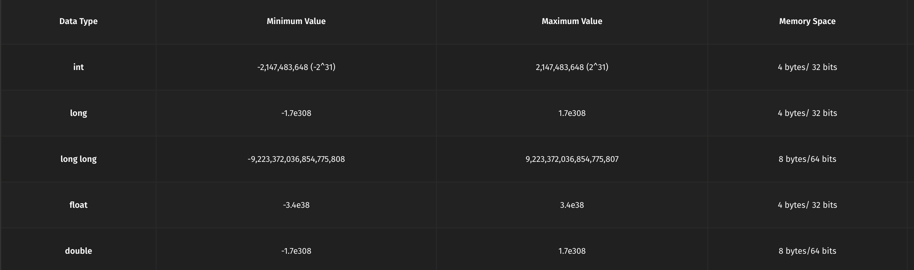

# Datatypes in C++

## int
It can store values from approximately  -2,147,483,647 to 2,147,483,647 (-2 billion to 2 billion). However, this range can vary, so it's essential to be aware of potential limitations when working with large numbers.

```cpp
#include<bits/stdc++.h>
using namespace std;

int main() {
    int x=10;

    cout << "Value of x: " << x;
    return 0;
}
// Output: Value of x: 10
```

**If you exceed the range of values an int can hold, it can lead to overflow or underflow.**

**The int data type typically occupies 4 bytes of memory on most systems.**

## long
When you need to store large numbers that exceed the limits of the int data type, the long data type is used.

It can store values ranging from approximately -9,223,372,036,854,775,807 to 9,223,372,036,854,775,807 (-9 quintillion to 9 quintillion)

>[!NOTE]
The amount of memory consumed by a long data type in C++ is typically **platform-dependent**. However, on most modern systems, a **long typically uses 4 bytes** (32 bits) of memory. Please note that these sizes can vary depending on the specific system and compiler being used. To determine the exact memory usage for a data type on your system, you can use the **sizeof** operator in C++. For example:

```cpp
#include<bits/stdc++.h>
using namespace std;

int main() {
    cout << "Size of long: " << sizeof(long) << " bytes" << endl;
    return 0;
}
// Output: Size of long: 4 bytes
```

## long long
This data type offers an even wider range, typically spanning from approximately -9 quintillion to 9 quintillion.

**The long long data type typically consumes 8 bytes of memory on most modern C++ compilers.** This is twice the memory used by the long data type, which usually requires 4 bytes.

## float
In C++, when it comes to **working with decimal numbers** or real values, two primary data types, **float and double**, are at your disposal. These data types are tailored for handling real numbers, but they differ in terms of precision and range.  
float is a single-precision floating-point data type in C++. The range of values it can represent is typically from about -3.4e38 to 3.4e38, and it provides approximately 6-9 significant digits of precision.

```cpp
#include<bits/stdc++.h>
using namespace std;

int main() {
    float x = 5.7653545f; // 'f' suffix indicates a float
    cout << "Value of x: " << x;
    return 0;
}
// Output: Value of x: 5.7653545
```

**The 'f' suffix is essential to indicate that we are working with a float literal.**

## double
The double-precision data type, simply known as double, offers higher precision and a broader range than its counterpart, float.  
double provides approximately 15-17 significant digits of precision.  
Range: double can handle a wide range of values, typically from about -1.7e308 to 1.7e308.

```cpp
#include<bits/stdc++.h>
using namespace std;

int main() {
    double x = 5.7653545; // No suffix needed for double  
    cout << "Value of x: " << x;
    return 0;
}
// Output: Value of x: 5.7653545
```



## String
Alongside the familiar numeric data types like int, double, and float, there's a versatile data type specifically designed for handling text and characters: the string.

C++ offers a convenient function called getline for reading entire lines of text from the user, making it an invaluable tool for working with strings.

Beginners in C++ often make the mistake of using cin to capture multi-word input into a single string. However, this approach has limitations, as demonstrated in the following code snippet:

```cpp
#include<bits/stdc++.h>
using namespace std;

int main() {
    string s;
    cin >> s;
    cout << "s: " << s << endl;
    return 0;
}
/*
Input: Hey Striver
Output: s: Hey
*/
```

If you input "Hey Striver," expecting both words "Hey" and "Striver" to be stored in the variable s, you're in for a surprise. This code will only capture the first word, "Hey," leaving "Striver" behind.

The cin object, when used with the >> operator, separates input based on whitespace. It reads until the first space character and assigns the characters before the space to the string variable. As a result, you can't capture multiple words in one go using this approach.

To solve this problem and capture both "Hey" and "Striver" as separate strings, we can modify the code and use two strings:

```cpp
#include<bits/stdc++.h>
using namespace std;

int main() {
    string s1, s2;
    cin >> s1 >> s2;
    cout << "s1: " << s1 << endl;
    cout << "s2: " << s2 << endl;
    return 0;
}
/*
Input: Hey Striver
Output:
s1: Hey
s2: Striver
*/
```

**In C++, when you need to capture an entire line of text, including spaces and special characters, the getline function is used.** It simplifies the process of reading and storing multi-word input from the user in one go.

The getline function is part of the C++ Standard Library and allows you to read an entire line of text from a source (usually the user) and store it in a string variable.

```cpp
#include<bits/stdc++.h>
using namespace std;

int main() {
    string str;
    getline(cin, str);
    cout << "You entered: " << str << endl;
    return 0;
}
/*
Input: Hey Striver, I am learning C++
Output: Hey Striver, I am learning C++
*/
```

When you run this program and input a sentence (e.g., "Hey Striver, I am learning C++."), it will capture the entire line, including spaces and punctuation but it will not be able to pick up inputs spanning over multiple lines.

```cpp
#include<bits/stdc++.h>
using namespace std;

int main() {
    string str;
    getline(cin, str);
    cout << "You entered: " << str << endl;
    return 0;
}
/*
Input:
Hey Striver, I am learning C++
I am Raj?
Output: Hey Striver, I am learning C++
*/
```

In this case, the program was unable to pick up “I am Raj?” because it was after the line break in the user input.

For memory management in string, Dynamic Memory Allocation is used. Think of C++ strings as magical containers. When you create a string and put text in it, the string automatically figures out how much memory it needs and sets it aside. You don't have to worry about how much space to allocate; C++ does that for you. This dynamic allocation means memory is used efficiently—no space wasted.

## Char
The char data type is used to store individual characters.Each char variable can hold only one character. 

```cpp
#include<bits/stdc++.h>
using namespace std;

int main() {
    char ch;
    cout << "Enter a character: ";
    cin >> ch;
    cout << "You entered: " << ch << endl;
    return 0;
}
/*
Input: Enter a character: 9
Output: You entered: 9
*/
```

>[!NOTE]
Single quotes (') are used to enclose individual characters when declaring or working with char data types, while double quotes (") are used to enclose sequences of characters, creating string objects. For example, 'A' represents a character, whereas "Hello" represents a string of characters. It's essential to use the correct quotation marks to distinguish between char and string literals in your code.

## Literals and Constants

Literals are numbers/letters that indicate the value of a constant.  
Ex\) Numeric Literals , String/Char Literals

Constants are variables that cannot be modified or changed by the program once their value is defined.  

There are 2 ways to define a constant:

1. Using **#define identifier value**
```cpp
#define LENGTH 20
```

2. Using const keyword  
**const data_type variable = value;**

```cpp
const int LENGTH=20;
```

Here the value LENGTH is a constant and 20 is literal.  
**The major difference is that constant may have an address in the memory whereas literal never has an address.** 

## Type Conversion

### Implicit Type Conversion:
It is also known as **Automatic Type Conversion.**
The compiler automatically converts one data type into another data type based on their Preferences. The user has nothing to do with it.
Implicit Type Conversion occurs when the expression has multiple data types.
Here is the priority order of the data types.
Implicit Conversion Example:

Example 1:

```cpp
#include <bits/stdc++.h>
using namespace std;

int main() {
  int x = 3;
  char y = 'a';
  if (x < y)
    cout << "y is greater than x" << endl;  //y>x
  else
    cout << "x is greater than y" << endl;  //x>y
  return 0;
} 
```
Explanation : 

x is of ‘int’ data type y is of ‘char’ data type. In the expression x < y, two different data types are being compared. A comparison is done between two different data types, so the compiler converts the low priority data type into a higher priority data type. **‘Char’ has low priority so it is converted into ‘int’ data type i.e ASCII of ‘a’.** So the comparison is 3 < 97 (since ASCII of ‘a’ is 97).

```cpp
#include <bits/stdc++.h>
using namespace std;

int main() {
    int x = 3;
    float y = 5.45;
    cout << x + y << endl;
} 
```
Explanation: 

x is of ‘int’ data type and y is ‘float’ data type. In expression x+y, two different data types are being added, so the compiler converts the lower priority data type into a higher priority data type. As f**loat has higher priority compared to int, x is converted to float and added to y.** So the output is float.

### Explicit Conversion: 
It is user-defined. It is called **Typecasting**. User type casts one data type to the desired data type.

Typecasting is done by explicitly defining the data type desired in front of the current data type variable in parenthesis.

Example 1:

```cpp
#include <bits/stdc++.h>
using namespace std;

int main() {
    int x = 98;
    cout << char(98) << endl;
} 
```
Explanation: Using type conversion x is converted into a char data type. Char corresponding to ASCII value 98 is b. So the output is b.

Example 2:

```cpp
#include <bits/stdc++.h>
using namespace std;

int main() {
    float x = 5.3455;
    cout << int(x) << endl;
    return 0;
} 
```
Explanation: Using type conversion x which is a float data type is converted into an int data type. Int value of 5.3455 is 5. So the output is 5.